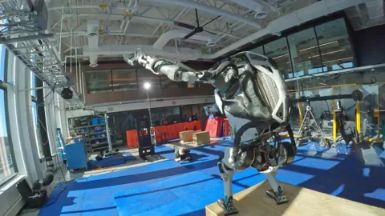

<h1 align='center'>Hi, I am Marcos Theodoro</h1>

	 
	

		
		
	

  

> <h2>Academic Background</h2>
> 
> - Control and Automation Engineering -- Federal University of Rio de Janeiro [UFRJ]
> 
> - Industrial Automation Technician -- Celso Suckow da Fonseca Federal Center for Technological Education [CEFET/RJ]

 

> <h2>Interests</h2>
>
> - Robotics & Internet of Things
> 
> - Data Science & Data Analysis
> 
> - Development & Deploying Tools
> 
> - Operating Systems and Distros

  

> <h2>Robotics</h2>

 

> <h2>Internet of Things</h2>

 

> <h2>Data Analysis</h2>

 

> <h2>Development and Deployment</h2>

 

> <h2>Operating Systems</h2>

